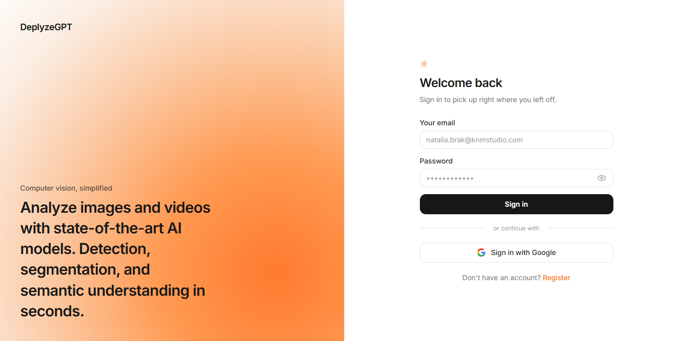
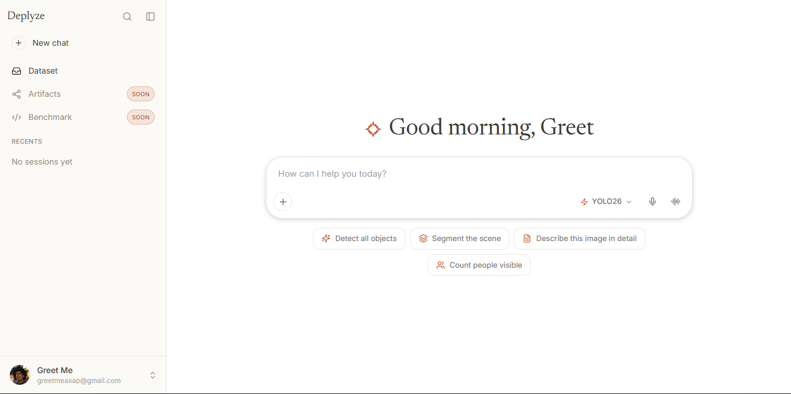
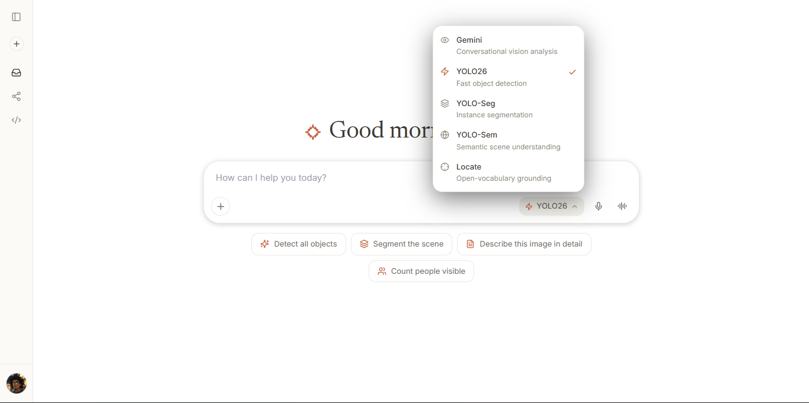

# DeplyzeGPT

DeplyzeGPT is an authenticated computer vision studio for image and video analysis. It combines a conversational React workspace with a FastAPI backend, offering real-time object detection (YOLO26), multimodal AI analysis (Gemini), and open-vocabulary visual grounding (LocateAnything-3B).

This codebase powers the live product at [deplyzegpt.xyz](https://deplyzegpt.xyz).

## Preview

<p align="center">
  
</p>
<p align="center">
  
</p>
<p align="center">
  
</p>

## Features

- **Multi-model analysis** — YOLO26 detection/segmentation, Gemini multimodal, and LocateAnything-3B visual grounding
- **Conversational UI** — Claude-style chat workspace with persistent named sessions
- **Firebase Auth** — email/password authentication with email verification
- **Cloud storage** — uploads and outputs stored in Cloudflare R2 with presigned URLs
- **Session history** — full conversation persistence in Firestore with multi-turn restore
- **Video processing** — async video analysis pipeline with progress tracking
- **Smart class filtering** — natural-language YOLO class selection via Gemini

## Architecture

```text
frontend/          React + CRA + Tailwind + shadcn/ui
                   Firebase client SDK for auth
                   Studio chat UI with sidebar sessions

backend/           FastAPI (Python)
                   Firebase Admin auth middleware
                   Firestore session/job persistence
                   Cloudflare R2 object storage (S3-compatible)
                   Gemini (Vertex AI) and YOLO26 analysis
                   LocateAnything-3B GPU worker integration

infrastructure/    Firebase Hosting (frontend)
                   Cloud Run (backend API + GPU workers)
                   Firestore (data)
                   Cloudflare R2 (file storage)
```

## Tech Stack

| Layer | Technology |
|-------|-----------|
| Frontend | React 18, Create React App, Tailwind CSS, shadcn/ui, Firebase JS SDK |
| Backend | Python 3.14, FastAPI, Uvicorn, OpenCV, Ultralytics YOLO26 |
| AI/ML | Google Gemini (Vertex AI), YOLO26n (det/seg/sem), nvidia/LocateAnything-3B |
| Auth | Firebase Authentication (email/password) |
| Database | Cloud Firestore |
| Storage | Cloudflare R2 (S3-compatible) |
| Hosting | Firebase Hosting (frontend), Google Cloud Run (backend) |
| CI/CD | GitHub Actions |

## Prerequisites

- Python 3.11+ (3.14 recommended)
- Node.js 20+ (24 recommended)
- A Firebase project with Authentication and Firestore enabled
- A Firebase service account JSON with Vertex AI access
- A Cloudflare R2 bucket with S3-compatible API credentials
- FFmpeg on PATH (for video output workflows)

## Setup

### 1. Clone the repository

```bash
git clone https://github.com/dyglo/vision-language.git
cd vision-language
```

### 2. Configure environment variables

Copy the example environment file and fill in your values:

```bash
cp .env.example backend/.env
```

See [`.env.example`](.env.example) for the full list of required variables. Key variables:

| Variable | Description |
|----------|-------------|
| `R2_BUCKET_NAME` | Your Cloudflare R2 bucket name |
| `R2_ENDPOINT_URL` | R2 S3-compatible endpoint (`https://<account_id>.r2.cloudflarestorage.com`) |
| `R2_ACCESS_KEY_ID` | R2 access key |
| `R2_SECRET_ACCESS_KEY` | R2 secret key |
| `FIREBASE_SERVICE_ACCOUNT_PATH` | Path to your Firebase Admin service account JSON |
| `VERTEX_AI_PROJECT` | Your GCP project ID |
| `VERTEX_GCS_BUCKET` | Your Firebase Storage bucket (`<project>.firebasestorage.app`) |
| `GEMINI_MODEL` | Gemini model name (e.g. `gemini-3-flash-preview`) |

For the frontend, create `frontend/.env`:

```dotenv
REACT_APP_FIREBASE_API_KEY=<your-firebase-web-api-key>
REACT_APP_FIREBASE_AUTH_DOMAIN=<project>.firebaseapp.com
REACT_APP_FIREBASE_PROJECT_ID=<project>
REACT_APP_FIREBASE_STORAGE_BUCKET=<project>.firebasestorage.app
REACT_APP_FIREBASE_MESSAGING_SENDER_ID=<sender-id>
REACT_APP_FIREBASE_APP_ID=<app-id>
REACT_APP_FIREBASE_MEASUREMENT_ID=<measurement-id>
REACT_APP_BACKEND_URL=http://127.0.0.1:8000
```

### 3. Install and run the backend

```bash
cd backend
pip install -r requirements.txt
uvicorn server:app --host 127.0.0.1 --port 8000
```

YOLO weights (`yolo26n.pt`, `yolo26n-seg.pt`, `yolo26n-sem.pt`) are downloaded automatically on first use.

### 4. Install and run the frontend

```bash
cd frontend
npm install --legacy-peer-deps
npm start
```

The app opens at `http://localhost:3000`.

### 5. Configure Firebase

Update `.firebaserc` and `firebase.json` with your Firebase project ID and Cloud Run service name before deploying.

Deploy Firestore rules:

```bash
firebase deploy --only firestore:rules --project <your-project-id>
```

## API Routes

All `/api/*` routes require a Firebase bearer token.

| Method | Path | Description |
|--------|------|-------------|
| `POST` | `/api/upload` | Upload image/video to R2 |
| `POST` | `/api/analyze/image` | Run image analysis (YOLO/Gemini/LocateAnything) |
| `POST` | `/api/analyze/video` | Start async video analysis |
| `POST` | `/api/analyze/video/gemini` | Gemini video analysis |
| `GET` | `/api/analyze/video/status/{job_id}` | Poll video job status |
| `GET` | `/api/files/{type}/{job_id}/{filename}` | Serve file from R2 |
| `GET` | `/api/files/presign/{job_id}` | Get presigned output URL |
| `GET` | `/api/files/download/{job_id}` | Stream output download |
| `POST` | `/api/sessions` | Create session |
| `GET` | `/api/sessions` | List user sessions |
| `PATCH` | `/api/sessions/{session_id}` | Update session |
| `DELETE` | `/api/sessions/{session_id}` | Delete session |
| `GET` | `/api/sessions/{session_id}/messages` | List session messages |

## Firestore Data Model

```text
sessions/{uid}/items/{session_id}
  name, model, pinned, created_at, updated_at

sessions/{uid}/items/{session_id}/messages/{message_id}
  role, content, input_r2_path, output_r2_path, output_type, job_id, model

jobs/{uid}/items/{job_id}
  type, status, progress, input_key, output_key, session_id
```

Per-user access is enforced in `firestore.rules`.

## Deployment

The CI/CD pipeline (`.github/workflows/ci.yml`) handles:

1. Backend quality checks (compile + ruff lint)
2. Frontend build verification
3. Secret scanning (gitleaks)
4. Backend deployment to Cloud Run (on push to `main`)
5. Frontend deployment to Firebase Hosting (on push to `main`)

All infrastructure identifiers are supplied via GitHub Actions secrets and repository variables. See the workflow file for the full list of required secrets/variables.

## License

[MIT](LICENSE)
