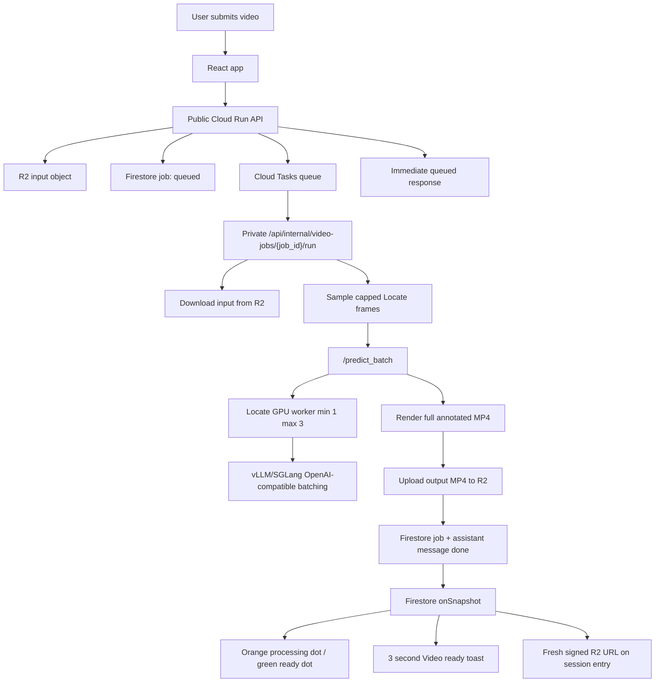

# Async Video Processing Architecture

## Summary

DeplyzeGPT video analysis now uses a durable async architecture for non-Gemini video work. The public API creates a Firestore job, persists chat placeholder state, enqueues a Cloud Tasks HTTP task, and returns immediately. A private Cloud Run worker route executes the video job, writes the output MP4 to Cloudflare R2, updates Firestore, and lets the React app update through Firestore listeners.

Launch performance targets:

- Locate GPU worker: `min instances=1`, `max instances=3`.
- Locate worker backend: vLLM or SGLang through an OpenAI-compatible endpoint.
- Locate video SLO: supported 60-second videos complete within 180 seconds p95 on the warm path.
- Locate analysis cap: at most 48 VLM analysis frames per job.
- Locate defaults: `LOCATE_VIDEO_MAX_DURATION_SECONDS=120`, `LOCATE_VIDEO_SAMPLE_SECONDS=2.5`, `LOCATE_VIDEO_FRAME_BATCH_SIZE=4`.

Raw Transformers `nvidia/LocateAnything-3B` remains valid for single-image analysis, but raw `generate` is batch-size-one. Video batch inference must use `LOCATE_WORKER_BACKEND=vllm` or `LOCATE_WORKER_BACKEND=sglang` with `LOCATE_OPENAI_BASE_URL` pointed at the batching backend.

## Architecture

## Backend Changes

- `backend/task_queue_service.py` creates deterministic Cloud Tasks HTTP tasks with OIDC auth and a 30-minute dispatch deadline cap.
- `backend/video_job_runner.py` owns idempotent Locate/YOLO execution, deterministic output keys, deterministic assistant message IDs, R2 upload, session status updates, and terminal error messages.
- `POST /api/analyze/video` now queues non-Gemini videos instead of running FastAPI background tasks.
- `POST /api/internal/video-jobs/{job_id}/run` is the private Cloud Tasks target and verifies either Cloud Tasks OIDC or `VIDEO_INTERNAL_SHARED_SECRET`.
- `backend/locate_video_processor.py` analyzes sampled frames in batches and renders the full MP4 by reusing nearest sampled detections instead of calling the GPU once per decoded frame.
- `backend/locate_worker/main.py` exposes `/predict_batch`; raw mode rejects multi-frame batch unless `LOCATE_RAW_BATCH_SEQUENTIAL=true`, while `vllm`/`sglang` mode forwards concurrent OpenAI-compatible requests for server-side continuous batching.

## Environment Ownership

Backend Cloud Run env vars are committed in `cloud-run-env.yaml`; secret placeholders are expanded from GitHub Actions secrets during CD.

| Variable | Owner |
| --- | --- |
| `FIREBASE_SERVICE_ACCOUNT_JSON_B64` | GitHub Actions secret `FIREBASE_ADMIN_SERVICE_ACCOUNT_JSON`, base64 encoded during deploy |
| `R2_BUCKET_NAME` | GitHub Actions secret |
| `R2_ENDPOINT_URL` | GitHub Actions secret |
| `R2_ACCESS_KEY_ID` | GitHub Actions secret |
| `R2_SECRET_ACCESS_KEY` | GitHub Actions secret |
| `VERTEX_AI_PROJECT`, `VERTEX_AI_LOCATION`, `VERTEX_GCS_BUCKET`, `GEMINI_MODEL` | `cloud-run-env.yaml` |
| `FIREBASE_PROJECT_ID`, `GOOGLE_CLOUD_PROJECT`, `GOOGLE_CLOUD_LOCATION`, `GCLOUD_PROJECT` | `cloud-run-env.yaml` |
| `CORS_ORIGINS` | `cloud-run-env.yaml` |
| `ENABLE_LOCATE_ANYTHING` | `cloud-run-env.yaml` |
| `ENABLE_LOCATE_ANYTHING_VIDEO` | `cloud-run-env.yaml`; keep `false` until vLLM/SGLang staging and p95 benchmarks pass |
| `LOCATE_ENDPOINT_URL`, `LOCATE_ENDPOINT_AUDIENCE` | `cloud-run-env.yaml` |
| `LOCATE_GENERATION_MODE`, `LOCATE_TIMEOUT_SECONDS`, `LOCATE_MAX_NEW_TOKENS`, `LOCATE_MAX_REQUEST_SIDE`, `LOCATE_RETRY_DELAY_SECONDS` | `cloud-run-env.yaml` |
| `LOCATE_BATCH_FALLBACK_TO_SEQUENTIAL` | `cloud-run-env.yaml`; keep `false` for video SLO protection |
| `LOCATE_VIDEO_MAX_DURATION_SECONDS`, `LOCATE_VIDEO_MAX_ANALYSIS_FRAMES`, `LOCATE_VIDEO_MAX_FRAMES`, `LOCATE_VIDEO_SAMPLE_SECONDS`, `LOCATE_VIDEO_SCENE_THRESHOLD` | `cloud-run-env.yaml` |
| `LOCATE_VIDEO_FRAME_TIMEOUT_SECONDS`, `LOCATE_VIDEO_JOB_TIMEOUT_SECONDS`, `LOCATE_VIDEO_FRAME_BATCH_SIZE`, `LOCATE_VIDEO_TARGET_P95_SECONDS` | `cloud-run-env.yaml` |
| `VIDEO_TASKS_PROJECT`, `VIDEO_TASKS_LOCATION`, `VIDEO_TASKS_QUEUE`, `VIDEO_WORKER_URL`, `VIDEO_TASKS_SERVICE_ACCOUNT_EMAIL`, `VIDEO_TASKS_OIDC_AUDIENCE`, `VIDEO_TASKS_DISPATCH_DEADLINE_SECONDS` | `cloud-run-env.yaml` |

Locate GPU worker env vars are separate from backend CD until the GPU service has its own deployment job:

| Variable | Owner |
| --- | --- |
| `LOCATE_WORKER_BACKEND` | GPU worker Cloud Run env var; must be `vllm` or `sglang` before enabling video |
| `LOCATE_OPENAI_BASE_URL` | GPU worker Cloud Run env var |
| `LOCATE_OPENAI_API_KEY` | GitHub Actions secret if the OpenAI-compatible backend requires a key |
| `LOCATE_OPENAI_MODEL`, `LOCATE_OPENAI_BATCH_CONCURRENCY`, `LOCATE_RAW_BATCH_SEQUENTIAL` | GPU worker Cloud Run env vars |

## Firestore And R2

Job documents keep R2 keys as the durable source of truth and generate signed URLs on demand through the public API.

New job fields include:

- `queued_at`, `started_at`, `finished_at`
- `task_name`, `task_retry_count`, `task_execution_count`
- `phase`, `frame_total`, `frame_completed`, `batch_total`, `batch_completed`
- `analysis_frame_cap`, `target_p95_seconds`, `backend`, `batch_size`
- `completed_unseen`, `user_message`, `error_code`

Session documents track:

- `video_job_status`
- `video_job_ids`
- `video_completed_unseen`

Firestore rules now make job documents client-readable but not client-writable.

## Frontend UX

- The React app listens to all video jobs for the current user through Firestore.
- Submitting a video only blocks until the queue acknowledges the job.
- Sidebar rows show an orange pulsing dot for queued/processing video and a green dot for unseen completed video.
- Opening a session clears its green completion indicator.
- Completion triggers a transient 3-second toast without navigating away.
- Restored sessions render in-progress placeholders, failed user-facing messages, or completed result videos with fresh signed URLs.

## Scaling Policy

Launch with:

- Cloud Run Locate GPU service `min instances=1`, `max instances=3`
- Cloud Tasks `max_concurrent_dispatches=3`
- Locate OpenAI-compatible request concurrency `4`

Scale beyond 3 L4 instances when any condition holds for two consecutive peak days:

- 60-second Locate video p95 end-to-end latency exceeds 180 seconds.
- p95 queue wait exceeds 30 seconds.
- Oldest queued job exceeds 90 seconds.
- queued plus processing jobs exceed `2 * max_gpu_instances` for more than 10 minutes.
- GPU worker is pinned at max instances for more than 15 minutes.
- p95 GPU inference time for a 4-frame batch exceeds 12 seconds after warmup.
- Firestore completion-to-toast latency exceeds 5 seconds.

Next step is regional L4 quota for 6 GPUs, GPU `max instances=6`, and Cloud Tasks `max_concurrent_dispatches=6`.

## Rollout

1. Deploy Firestore rules and backend with queue env vars configured.
2. Deploy Locate GPU worker in `vllm` or `sglang` mode with `LOCATE_OPENAI_BASE_URL`.
3. Create Cloud Tasks queue `video-processing` with `max_concurrent_dispatches=3`, `max_dispatches_per_second=3`, max attempts `3`.
4. Grant the Cloud Tasks service account `roles/run.invoker` on the private worker.
5. Enable `ENABLE_LOCATE_ANYTHING_VIDEO=true`.
6. Run staging jobs for Locate 30s/60s, YOLO detection, YOLO segmentation, forced retry, forced worker failure, and frame-cap rejection.
