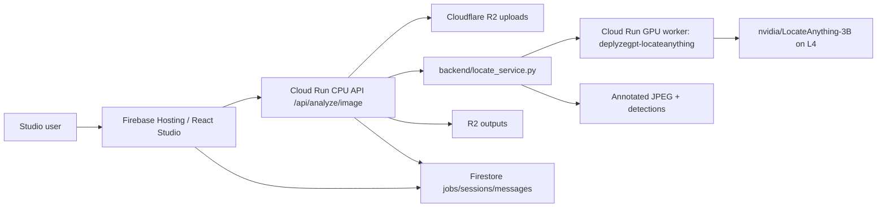

# LocateAnything-3B Studio Integration Plan

## Summary

DeplyzeGPT adds `nvidia/LocateAnything-3B` as a research-preview Studio model named `locate-anything`. The model is image-only in v1 and is gated by `ENABLE_LOCATE_ANYTHING=false` on the backend plus `REACT_APP_ENABLE_LOCATE_ANYTHING=false` on the frontend.

LocateAnything differs from the existing YOLO models because it performs open-vocabulary visual grounding from natural-language prompts. The backend keeps the existing Studio API contract: the frontend calls `POST /api/analyze/image`, the API downloads the uploaded file from R2, calls a separate GPU worker, renders annotated output, stores the annotated image back to R2, and persists the assistant message in Firestore.

## Recommended Inference Host

Use a separate Google Cloud Run GPU service in `europe-west1`:

- Service name: `deplyzegpt-locateanything`
- GPU: 1x NVIDIA L4, 24 GB VRAM
- CPU/memory: 4 vCPU, 16 GiB minimum
- Billing/scaling: instance-based billing, min instances `0`, max instances `1`, concurrency `1`, timeout `600s`, no GPU zonal redundancy for v1
- Backend connection: current CPU Cloud Run API calls the GPU service over authenticated HTTP using `LOCATE_ENDPOINT_URL` and `LOCATE_ENDPOINT_AUDIENCE`

Estimated active Cloud Run GPU cost is about `$1.05/hour` or `$0.017/minute` for 1x L4 plus 4 vCPU and 16 GiB. If kept warm all month, cost is about `$764/month`; with min instances `0`, 100 requests at 3 active minutes each is about `$5`, and 100 requests at 15 active minutes each is about `$26`.

Alternatives considered:

- Hugging Face Inference Endpoints: cheaper per warm hour (`$0.70/hour` on GCP L4, `$0.80/hour` on AWS L4), but LocateAnything is not deployed by a hosted Inference Provider and would still need custom serving. Scale-to-zero can take minutes and may surface 503s unless callers wait.
- Vertex AI custom prediction: good for model registry, traffic splitting, and enterprise monitoring, but heavier to operate. `g2-standard-4` is about `$0.81293/hour`; scale-to-zero is a preview path.
- Compute Engine G2 or spot VM: useful later for queue/batch workloads, but v1 should avoid VM lifecycle and patching work.



## Implementation Shape

Backend CPU API:

- `backend/locate_service.py` is a remote inference client plus parser/renderer.
- `server.py` branches on `payload.model == "locate-anything"` inside `POST /api/analyze/image`.
- The YOLO class-filter path is skipped for LocateAnything.
- Images sent to the GPU worker are JPEG-encoded and resized to `LOCATE_MAX_REQUEST_SIDE=1024` by default to keep request bodies and L4 memory use manageable; coordinates still render on the original image dimensions.
- The CPU API retries transient worker cold-start responses (`429`, `502`, `503`, `504`) until `LOCATE_TIMEOUT_SECONDS` is reached, with `LOCATE_RETRY_DELAY_SECONDS=5` by default. This is required because a scale-from-zero L4 worker can return "no available instance" while the 3B model is still loading.
- The output follows the existing image result shape: `{ type, content, detections, suggestions }`.
- The assistant message uses existing Firestore fields: `output_type: "image"`, `output_r2_path`, `model: "locate-anything"`, and `detections`.
- `POST /api/analyze/video` rejects `locate-anything` with 422 because video is out of scope for v1.

GPU worker:

- `backend/locate_worker/main.py` exposes `GET /health` and `POST /predict`.
- `POST /predict` accepts `{ image_b64, prompt, generation_mode, max_new_tokens }`.
- The worker loads `nvidia/LocateAnything-3B` with Transformers and `trust_remote_code=True`.
- `generation_mode` defaults to `hybrid`.
- The worker should load weights from a mirrored artifact or mounted repository path for production; direct Hugging Face loading is acceptable only for early experiments.

Frontend:

- `Studio.jsx` adds `Locate` to the model list only when `REACT_APP_ENABLE_LOCATE_ANYTHING=true`.
- `ChatInputBar.jsx` disables Locate for video attachments.
- `ChatMessages.jsx` displays `LocateAnything-3B` for restored and live results.
- Existing annotated-image rendering is reused.

## Output Contract

LocateAnything returns text with normalized coordinate tokens. The backend parses:

- Boxes: `<box><x1><y1><x2><y2></box>`
- Points: `<box><x><y></box>`

Coordinates are clamped to `[0, 1000]`, scaled to the image pixel dimensions, and stored as:

```json
{ "kind": "box", "class": "people wearing red shirts", "bbox": [x1, y1, x2, y2] }
{ "kind": "point", "class": "traffic light", "point": [x, y] }
```

The annotated JPEG is stored in the same R2 output path pattern used by YOLO: `outputs/{uid}/{session_id}/{job_id}/output.jpg`.

## Phased Rollout

Phase 1:

- Image-only LocateAnything grounding.
- Single Cloud Run GPU worker.
- Feature flags disabled by default.
- Existing Studio image result UI.
- Manual license guard in configuration and release notes: NVIDIA non-commercial research license, not for commercial deployment.

Phase 2:

- Add video only after image latency, accuracy, and cost are measured.
- Start with sampled-frame grounding before full frame-by-frame rendering.
- Evaluate batching, warm min instances during demos, model artifact mirroring, and quantization only after quality testing.
- Reconsider Vertex AI or a queue-backed G2 VM if traffic becomes sustained or batch-oriented.

## Test Plan

- Unit-test LocateAnything coordinate parsing for boxes, points, malformed tokens, clamping, and pixel scaling.
- Unit-test annotation rendering for at least one box and one point.
- Backend route smoke: mock `analyze_image_locate`, verify `/api/analyze/image` stores an image output and detections.
- Backend route smoke: `locate-anything` video returns 422.
- Frontend smoke: model dropdown includes Locate when enabled and image results render with detection chips.
- Manual smoke: upload JPEG, prompt `people wearing red shirts`, confirm annotated image, download works, refresh session, confirm message restore.

## Sources

- Hugging Face model card: https://huggingface.co/nvidia/LocateAnything-3B
- Hugging Face Inference Endpoints pricing/autoscaling/custom containers: https://huggingface.co/docs/inference-endpoints/en/support/pricing, https://huggingface.co/docs/inference-endpoints/en/guides/autoscaling, https://huggingface.co/docs/inference-endpoints/en/engines/custom_container
- Cloud Run GPU docs/pricing/best practices: https://docs.cloud.google.com/run/docs/configuring/services/gpu, https://cloud.google.com/run/pricing, https://docs.cloud.google.com/run/docs/configuring/services/gpu-best-practices
- Vertex AI pricing/autoscaling: https://cloud.google.com/vertex-ai/pricing, https://docs.cloud.google.com/vertex-ai/docs/predictions/autoscaling
